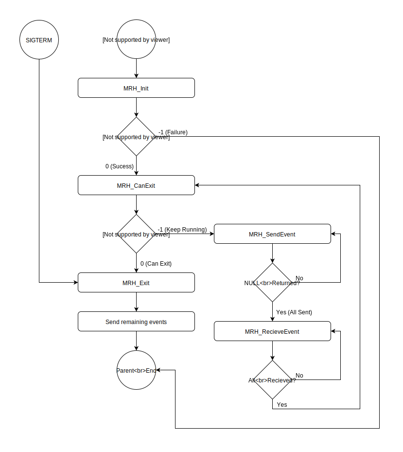

********************
Application Run Loop
********************
Shown here is the lifetime run loop for any MRH platform application. 
This loop is achieved by using the supplied functions found in the 
application loop header:

.. code-block:: c

    #include <libmrh/MRH_AppLoop.h>
    #include <libmrh.h> // Includes libmrh/MRH_AppLoop.h

All functions declared in the MRH_AppLoop header have to be implemented 
by the user application to be usable. Missing functions will result in the 
application refusing to run.

The application loop never changes and will always be performed in the 
following order:

   

MRH_Init
--------
The :doc:`../Functions/libmrh_Directory/MRH_AppLoop/MRH_Init` 
function is used to initialize the application. This allows to 
prepare data required for operation and event creation to be sent 
in the first event update loop.

MRH_CanExit
-----------
The :doc:`../Functions/libmrh_Directory/MRH_AppLoop/MRH_CanExit` 
function is called after every event update loop to check if the 
application should keep running.

MRH_SendEvent
-------------
The :doc:`../Functions/libmrh_Directory/MRH_AppLoop/MRH_SendEvent` function 
will be called after the last recieve event call for as long as the function 
does not return NULL. Returning NULL signals that all events available to be 
sent are given to the application parent.

MRH_RecieveEvent
----------------
The :doc:`../Functions/libmrh_Directory/MRH_AppLoop/MRH_RecieveEvent` 
function is called for every event to be recieved by the application. 
It is called directly after the last event was sent by the application.

MRH_Exit
--------
:doc:`../Functions/libmrh_Directory/MRH_AppLoop/MRH_Exit` will be called once 
if a normal shutdown is requested (either by SIGTERM or if CanExit returns 0).
This function allows for cleanup and finishing tasks.